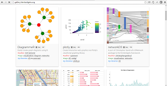

<style type="text/css">

slides > slide:before {
  font-size: 12pt;
  content: 'http://shiny.rstudio.com/';
  position: absolute;
  text-align: center;
  bottom: 15px;
  left: 50%;  
  margin-left: -300px;
  width: 600px;
  line-height: 1.9;
}

div.img-col{
  text-align: center;
  font-size: 14pt;
}

a {
  border-bottom: none !important;
}

.wrapper {
  margin: 70px auto;
  position: relative;
  z-index: 90;
}

.ribbon-wrapper-green {
  width: 145px;
  height: 148px;
  overflow: hidden;
  position: absolute;
  top: -3px;
  right: -3px;
}

.ribbon-green {
  font: bold 15px Sans-Serif;
  color: #333;
  text-align: center;
  text-shadow: rgba(255,255,255,0.5) 0px 1px 0px;
  -webkit-transform: rotate(45deg);
  -moz-transform:    rotate(45deg);
  -ms-transform:     rotate(45deg);
  -o-transform:      rotate(45deg);
  position: relative;
  padding: 7px 0;
  left: -25px;
  top: 45px;
  width: 220px;
  background-color: #7ADCBF;
  background-image: -webkit-gradient(linear, left top, left bottom, from(#8AACDF), to(#658FBE)); 
  background-image: -webkit-linear-gradient(top, #8AACDF, #658FBE); 
  background-image:    -moz-linear-gradient(top, #8AACDF, #658FBE); 
  background-image:     -ms-linear-gradient(top, #8AACDF, #658FBE); 
  background-image:      -o-linear-gradient(top, #8AACDF, #658FBE); 
  color: #6a6340;
  -webkit-box-shadow: 0px 0px 3px rgba(0,0,0,0.3);
  -moz-box-shadow:    0px 0px 3px rgba(0,0,0,0.3);
  box-shadow:         0px 0px 3px rgba(0,0,0,0.3);
}

.ribbon-green:before, .ribbon-green:after {
  content: "";
  border-top:   3px solid #00896e;   
  border-left:  3px solid transparent;
  border-right: 3px solid transparent;
  position:absolute;
  bottom: -3px;
}

.ribbon-green:before {
  left: 0;
}
.ribbon-green:after {
  right: 0;
}
</style>

# Overview

## Outline

### We'll Cover Three Main Areas:
<div class="columns-2">
- Combining Shiny & R Markdown
- flexdashboard
- shinydashboard
- HTML Templates
- Crosstalk
- Pharma Examples

<div class="img-col">

   
 </div>
</div>

## My Story & How I Got Here
### About:
 - CS Background
 - B2S Life Sciences
 - Book Note - Statistical Methods for Immunogenicity Assessment
 
## Freedom to Build...

- “This is your world...You’re the creator...Find freedom on this canvas...Believe, that you can do it, ‘Cuz you can do it. You can do it.” 
― Bob Ross"

# Part 1 - Combining Shiny & R Markdown

## Intro to RMD

<div class="columns-2">
- 1_RMD_Stocks - What is RMD

</div>

## Example R Markdown Doc -- `Example.RMD`

- Create a new R Markdown document in the IDE by going to 'File' and select 'New File' and select 'R Markdown...' and create a new document and leave output as HTML
<div class="columns-4"></a> </div>

- Then select Knit and save it as Example.RMD </td>
<td></td>
</tr>
</table>

## flexdashboard - Publish Data Visualizations as a Dashboard

<div class="columns-2">
- [flexdashboard](http://rmarkdown.rstudio.com/flexdashboard/)
- [Access to Hospital Care Dashboard](http://colorado.rstudio.com:3939/content/188/)
- [Hospital Infections Capital Region of Denmark — 2017](https://hospinf.shinyapps.io/hospinf/)
- [Gene Expression Biclustering - Bryan Lewis](https://jjallaire.shinyapps.io/shiny-biclust/)
- [Iris K-Means Clustering](https://jjallaire.shinyapps.io/shiny-kmeans/)
- [Combining Shiny & R Markdown](https://github.com/philbowsher/Combining-Shiny-R-Markdown)

<div class="img-col">
<a href="https://jjallaire.shinyapps.io/shiny-biclust/"></a>

</div>

## flexdashboard Examples

<div class="columns-2">
- 2_RMD_Flex_RMD_To_Shiny_Intro
- 3_RMD_Flex_ToothGrowth
- 4_RMD_Flex_Shiny_ToothGrowth

</div>

## Shiny/R Markdown Examples

<div class="columns-2">
- [shiny-examples](https://github.com/rstudio/shiny-examples/)
- [FDA Adverse (Drug) Event Dashboard](https://github.com/statwonk/openfda-dashboard)
- [FDA Adverse Event Dashboard](https://diabetescheck.shinyapps.io/openfda-dashboard/)
- [interAdapt - An Interactive Planner for Group Sequential, Adaptive Enrichment Designs](https://michaelrosenblum.shinyapps.io/interAdapt/)
- [Export a report from Shiny - Simple Example](http://shiny.rstudio.com/gallery/download-knitr-reports.html)
 - [AplusB: A + B design investigator for phase I dose-escalation studies](https://graham-wheeler.shinyapps.io/AplusB/)

<div class="img-col">
   
 </div>
</div>

</div>

## Interactive-Reporting-Dashboards-in-Shiny

- [Interactive-Reporting-Dashboards-in-Shiny](https://github.com/philbowsher/Interactive-Reporting-Dashboards-in-Shiny)
- [Interactive plots](http://shiny.rstudio.com/gallery/)
- [1_Shiny_Basic_Plots](http://shiny.rstudio.com/gallery/plot-interaction-exclude.html)

## Shiny Example - Interactive Plot ToothGrowth 1_Shiny_Basic_Plots
```{r, echo=FALSE}
library(ggplot2)
library(Cairo)   # For nicer ggplot2 output when deployed on Linux
library(datasets)

dataset <- ToothGrowth

ui <- fluidPage(
  fluidRow(
    
    column(width = 6,
           plotOutput("plot1", height = 350,
                      click = "plot1_click",
                      brush = brushOpts(
                        id = "plot1_brush"
                      )
           ),
           actionButton("exclude_toggle", "Toggle points"),
           actionButton("exclude_reset", "Reset")
    )
  )
)

server <- function(input, output) {
  # For storing which rows have been excluded
  vals <- reactiveValues(
    keeprows = rep(TRUE, nrow( dataset))
  )
  
  output$plot1 <- renderPlot({
    # Plot the kept and excluded points as two separate data sets
    keep    <-  dataset[ vals$keeprows, , drop = FALSE]
    exclude <-  dataset[!vals$keeprows, , drop = FALSE]
    
    ggplot(keep, aes(dose, len)) + geom_point() +
      geom_smooth(method = lm, fullrange = TRUE, color = "black") +
      geom_point(data = exclude, shape = 21, fill = NA, color = "black", alpha = 0.25) +
      coord_cartesian(xlim = c(0.5, 2.0), ylim = c(5,35))
  })
  
  # Toggle points that are clicked
  observeEvent(input$plot1_click, {
    res <- nearPoints( dataset, input$plot1_click, allRows = TRUE)
    
    vals$keeprows <- xor(vals$keeprows, res$selected_)
  })
  
  # Toggle points that are brushed, when button is clicked
  observeEvent(input$exclude_toggle, {
    res <- brushedPoints( dataset, input$plot1_brush, allRows = TRUE)
    
    vals$keeprows <- xor(vals$keeprows, res$selected_)
  })
  
  # Reset all points
  observeEvent(input$exclude_reset, {
    vals$keeprows <- rep(TRUE, nrow( dataset))
  })
  
}

shinyApp(ui, server)
```

# Part 2 - shinydashboard

## Shiny Development Example - 3_Shiny_Immunogenicity_3Tier

<div class="columns-2">
- [Pharmacometrics: some Shiny applications](http://webpopix.org/shiny/ShinyExamples.html)
- [CDC PrEP Guidelines ](https://prism.shinyapps.io/cdc-prep-guidelines/)
- [CDC Zika Data](https://chendaniely.shinyapps.io/zika_cdc_dashboard/)
- [shinydashboard](https://rstudio.github.io/shinydashboard/)
- ADA three‐tiered testing strategy is deployed to assess ADA on sample data.
- 2_Shiny_shinydashboard_basic

</div>
 
## HTML Widgets R Bindings to JavaScript Libraries

<div class="columns-2">

- Used at the R console for data analysis just like conventional R plots (via RStudio Viewer).
- Seamlessly embedded within R Markdown documents and Shiny web applications.
- Saved as standalone web pages for ad-hoc sharing via email, Dropbox, etc.

<div class="img-col"><a href="http://www.htmlwidgets.org/showcase_leaflet.html"></a>
 </div>
 
</div>

## Live HTML Widgets Examples

<div class="columns-2">
- [Institute for Quantitative Social Science - statistical analysis of genomic data for antibiotic resistant strains of mycobacterium tuberculosis by Amanda Winburn and others](https://hmdc.shinyapps.io/genTB/)
- [Best & Worst California Hospitals for Surgery by Gary Chung
](https://gchung.shinyapps.io/CAhospitals/)
- [canvasXpress - developed as the core visualization component for bioinformatics and systems biology analysis at Bristol-Myers Squibb by Isaac Neuhaus
](http://canvasxpress.org/)
- [Visualizing U.S. Clinical Trials
](https://gchung.shinyapps.io/CTgov/)

<div class="img-col">
 </div>

</div>

# Part 3 - HTML Templates

## Shiny Development Example - 4_Shiny_Immunogenicity_htmlTemplate

<div class="columns-2">
- Simple Immunogenicity report via Shiny html template
- [HTML Templates](http://shiny.rstudio.com/articles/templates.html)
- [Developing and deploying large scale Shiny applications ](https://channel9.msdn.com/Events/useR-international-R-User-conferences/useR-International-R-User-2017-Conference/Developing-and-deploying-large-scale-Shiny-applications-for-non-life-insurance)

</div>

# Part 4 - Crosstalk

## What Shiny functions are being used below?
```{r, echo=FALSE}
library(d3scatter)
library(crosstalk)

shared_ToothGrowth <- SharedData$new(ToothGrowth)
bscols(widths = c(3,NA,NA),
  list(
    filter_checkbox("supp", "supp", shared_ToothGrowth, ~supp, inline = TRUE),
    filter_slider("dose", "dose", shared_ToothGrowth, ~dose, width = "100%")
  ),
  d3scatter(shared_ToothGrowth, ~dose, ~len, ~factor(supp), width="100%", height=250),
  d3scatter(shared_ToothGrowth, ~len, ~dose, ~factor(supp), width="100%", height=250)
)
```

## None - It's Crosstalk

- http://rstudio.github.io/crosstalk/index.html
- Crosstalk is an add-on to the htmlwidgets package
- It extends htmlwidgets with a set of classes, functions, and (currently, linked brushing and filtering)
- Crosstalk doesn’t require the use of Shiny
- On the other hand, you can use Crosstalk and Shiny together to broaden the capabilities of each

## Crosstalk Examples

<div class="columns-2">
- 1_htmlwidgets_crosstalk_ToothGrowth
- 2_htmlwidgets_crosstalk_Shiny_ToothGrowth

</div>

## shiny Package & Shiny Server

<table width="100%" style="border-spacing: 50px; border-collapse: separate; margin: -50px auto;">
<tr>
<td style="vertical-align: top; padding-top: 1em">
### shiny Package
Shiny is an open source R package that provides a web framework for building interactive web applications using R.
</td>
<td></td>
</tr><tr>
<td style="vertical-align: top; padding-top: 1em">
### Shiny Server
Shiny Server is a server program that lets you host and manage shiny web applications and interactive documents online.
</td>
<td></td>
</tr>
</table>

## Q/A...

<div class="columns-4"></a>

</div>

## Come see us at the RStudio Conference...

- https://www.rstudio.com/conference/
- San Diego January 31 to Feb 3

<div class="columns-4"></a>

</div>

# Appendix

## Platforms & Tools
- [mrgsolve facilitates simulation in R from hierarchical, ordinary differential equation (ODE)-based models typically employed in drug development](https://www.metrumrg.com/try-open-source-tools/)
- [Shares information about ITN's clinical studies and specimen bio-repository](https://www.itntrialshare.org/)
- [Bio3D-web is a new online application for the user friendly investigation of protein structure ensembles](http://129.177.232.111:3848/pca-app/?SSUID=2017-07-20_369c3a8b40e0)
- [Software, databases and learning material maintained by bioinformatics platform members](http://bioinformatics.mdc-berlin.de/resources.html)
- [Environment for medical and genomic research](https://www.synapse.org/)

## Applications in Research - Github
- https://github.com/rstudio/shiny_example
- https://shiny.rstudio.com/articles/deployment-local.html
- https://github.com/crtahlin/medplot
- runGitHub("medplot", "crtahlin", subdir = "inst/shinyapp_symptoms2")
- https://www.ncbi.nlm.nih.gov/pmc/articles/PMC4383594/
- library(medplot) medplotOnline()
- https://github.com/xtmgah/DDCV
- https://arxiv.org/pdf/1404.0734.pdf

## Applications in Research - Modeling
- https://www.ncbi.nlm.nih.gov/pubmed/25733352

## Applications in Research - Teaching
- [Web Application Teaching Tools for Statistics Using R and Shiny](http://escholarship.org/uc/item/00d4q8cp)


## Pharmacokinetics

 - [Interactive Pharmacometric Applications Using R and the Shiny Package](http://www.ncbi.nlm.nih.gov/pmc/articles/PMC4394611/)
 - [Simple example of modeling and postprocessing a bayesian dataset with nonmem](http://devinpastoor.com/simplest_bayes/bayesian-analysis.html)
- [Bioequivalence v0.3 by Andrey Ogurtsov](https://statist.shinyapps.io/bioeq_en/)
- [Pharmacometrics: some Shiny applications](http://webpopix.org/shiny/ShinyExamples.html)
 - [Glucose Insulin Dynamics and SGLT 1/2 inhibition](http://qsp.engr.uga.edu:3838/GluIns/GluIns1.d/)
- [drinkR: Estimate your Blood Alcohol Concentration (BAC](https://rasmusab.shinyapps.io/drinkr/)

## Clinical Trials

- [interAdapt - An Interactive Planner for Group Sequential, Adaptive Enrichment Designs](https://michaelrosenblum.shinyapps.io/interAdapt/) & [here](http://arxiv.org/pdf/1404.0734.pdf)
 - [AplusB: A + B design investigator for phase I dose-escalation studies](https://graham-wheeler.shinyapps.io/AplusB/)
 - [medplot by Crt Ahlin & Lara Lusa to  facilitate the exploration and analysis of longitudinal data](http://shiny.mf.uni-lj.si/medplot/)
  - [Application to visualize meta-analysis as physical weights on scales](https://chjackson.shinyapps.io/MetaAnalyser/)
  - [BioPET is a tool for helping investigators evaluate whether a biomarker or risk model is useful for prognostic enrichment of a clinical trial](https://jhroth.shinyapps.io/WebApp/)
  
## Clinical Trials Cont.
  
  - [gsDesign R package for deriving and describing group sequential designs trials by Keaven Anderson](https://cran.r-project.org/web/packages/gsDesign/index.html) & [here](https://www.youtube.com/watch?v=CJoHdbF2wE4)
  - [List of R Shiny Applications](https://brpnci.shinyapps.io/main/)
 - https://brbnci.shinyapps.io/BasketTrials/
 - https://github.com/brbnci/BasketTrials
 - https://rgulati.shinyapps.io/calculator/
- http://schedule.user2016.org/event/7BXX/mavis-meta-analysis-via-shiny
- http://kylehamilton.net/shiny/MAVIS/
- https://aurora.shinyapps.io/random_gen/
- https://cran.r-project.org/web/views/ClinicalTrials.html
 
 
## Genomics & Proteomics

  - [Human eyeIntegration web app](https://eyeintegration.nei.nih.gov/)
  - [Gene Expression Biclustering - Bryan Lewis](https://jjallaire.shinyapps.io/shiny-biclust/)
  - [Visualize and explore an entire genome](https://gallery.shinyapps.io/genome_browser/)
  - [Use phenotypes and genotypes to detect novel disease gene candidates ](http://omimexplorer.research.bcm.edu:3838/omim_explorer/)
  - [Visualisation of proteomics data using R and Bioconductor](https://www.bioconductor.org/packages/release/data/experiment/vignettes/RforProteomics/inst/doc/RProtVis.html)

## Immunogenicity & Adverse Advents

 - [Immunogenicity Assessments](http://www.ncbi.nlm.nih.gov/pubmed/25733352) 
 - [shiny Applications with openFDA Data](http://www.gersonides.com/openfda/)
 - [Repository of shiny apps that use the openfda API](https://github.com/jonathanglevine/openfdashinyapps)
 - [ropenhealth/openfda](https://github.com/rOpenHealth/openfda) & [adverse events analysis by Fisseha Berhane](http://datascienceplus.com/working-with-databases-in-r/)
 - [Adverse Events Reports](https://openfda.shinyapps.io/dash/?t1=aspirin&v1=patient.drug.openfda.generic_name)
 - [Adverse Event Dashboard](https://diabetescheck.shinyapps.io/openfda-dashboard/)

## Disease/Epidemioogy

 - [CDC Weekly Case Count](https://gallery.shinyapps.io/CDCPlot/)
 - [Ebola Model](https://gallery.shinyapps.io/Ebola-Dynamic/)
 - [Influenza types from global surveillance isolates](https://pmacp.shinyapps.io/Influenza_isolates/)
 - [Impact of HIV Pre-Exposure Prophylaxis among MSM in the United States](https://prism.shinyapps.io/cdc-prep-guidelines/)
 - [Bacterial Growth Curve Analysis](https://mdphan.shinyapps.io/GrowthCurvesAnalysis/)
 - [CDC Zika Data](https://chendaniely.shinyapps.io/zika_cdc_dashboard/)
 - [Health & economic impact, achieving the WHO targets
for control and elimination of London Declaration NTDs](https://erasmusmcmgz.shinyapps.io/dissemination/)

## Hospital/Medicine

 - [Shiny in Medicine](https://rviews.rstudio.com/2017/05/03/shiny-in-medicine/)
 - [Health Equity Assessment Toolkit ](https://whoequity.shinyapps.io/HEAT/)
 - [Emergency Department Simulation](https://gallery.shinyapps.io/EDsimulation/)
 - [Colorectal Cancer - 10 year Predicted Risk Online](http://riskcalc.org/ColorectalCancer/)
 - [US Hospitals Ranking Shiny App](http://datascience-enthusiast.com/R/Hospital_Rankings.html)
- [Access to Hospital Care Dashboard](http://colorado.rstudio.com:3939/content/188/)
- [Hospital Infections ](https://hospinf.shinyapps.io/hospinf/)
- [Comparing Scores from Different Patient Reported Outcomes using Item Response Theory ](http://www.common-metrics.org/app.php)
- [Advanced analysis of your DNA](http://www.impute.me/)
- [2014 WHO Growth Charts for Canada, 2-19 years](http://apps.cpeg-gcep.net/growth219_DDE/)

## Report Generation & Automation for Clinical Research

 - [Shiny package](http://shiny.rstudio.com/) & [Shiny Server](https://www.rstudio.com/products/shiny/download-server/)
 - [R Markdown](http://rmarkdown.rstudio.com/)
 - [Sweave and knitr...](https://support.rstudio.com/hc/en-us/articles/200552056-Using-Sweave-and-knitr) [knitr is an engine for dynamic report generation with R. It enables integration of R code into LaTeX, LyX, HTML, Markdown, AsciiDoc, & reStructuredText documents. ](https://cran.r-project.org/web/packages/knitr/index.html)
  - [LaTex Directions to use Sweave and knitr to create PDF reports.](http://www.latex-project.org/get/)
  - [The RTF package, a set of R functions to output Rich Text Format RTF files with high resolution tables & graphics.](https://cran.r-project.org/web/packages/rtf/rtf.pdf)
 - [ReporteRs by David Gohel: Microsoft Word, Microsoft PowerPoint & HTML Documents Generation from R](https://cran.r-project.org/web/packages/ReporteRs/index.html)[formerly R2DOCX package](http://davidgohel.github.io/R2DOCX/index.html)

## Report Generation & Automation for Clinical Research Cont.

 - [CRAN Task View: Reproducible Research](https://cran.r-project.org/web/views/ReproducibleResearch.html)
 - [xtable: Export Tables to LaTeX or HTML](https://cran.r-project.org/web/packages/xtable/index.html)
 - [DT: An R interface to the DataTables library](http://rstudio.github.io/DT/)
  - [R Markdown Document Templates - re-usable document templates](http://rmarkdown.rstudio.com/developer_document_templates.html)

## Other
 - [Bayesian inference](https://r.amherst.edu/apps/nhorton/Shiny-Bayes/)
 - [PeLiCa - The Peptide Library Calculator](http://www.pelica.org/)
 - [Survival Analysis (SASR)](https://jzliu.shinyapps.io/SASR/)
 - [MAVIS - meta-analysis](http://kylehamilton.net/shiny/MAVIS/)
 - [A social network for clinical trial designers, under development](https://github.com/professorbeautiful/CTDesignExperimenter)
 - [Ebola Model](https://gallery.shinyapps.io/Ebola-Dynamic/)
 - [CDC Data Visualization](https://gallery.shinyapps.io/CDCPlot/)
 - [Using R for Biomedical Statistics booklet](http://a-little-book-of-r-for-biomedical-statistics.readthedocs.io/en/latest/)

## Other Cont.
 
 - [Randomization table for clinical trials](https://aurora.shinyapps.io/random_gen/)
 - [Plot Your Data](https://pharmacometrics.shinyapps.io/ggplotmydata/ggplotwithyourdata.Rmd)
 - [Ibuprofen Dosing Regimens ](https://acp-unisa.shinyapps.io/Ibuprofen/)
 - [Analyze Data on Socrata using CSV Open Data APIs](https://marks-skram.shinyapps.io/shiny_socrata/)
 </div>
- [MARS, Meta-Analysis, for 'modeling visualization' in Pharmacometrics](https://jzliu.shinyapps.io/MARS/)
- [Information on R in clinical research by Adrian Olszewski](http://www.r-clinical-research.com/)
- [Documents for the use of both RStudio IDE and Shiny Server Pro commercial products in regulated clinical trial environments here](https://www.rstudio.com/about/)